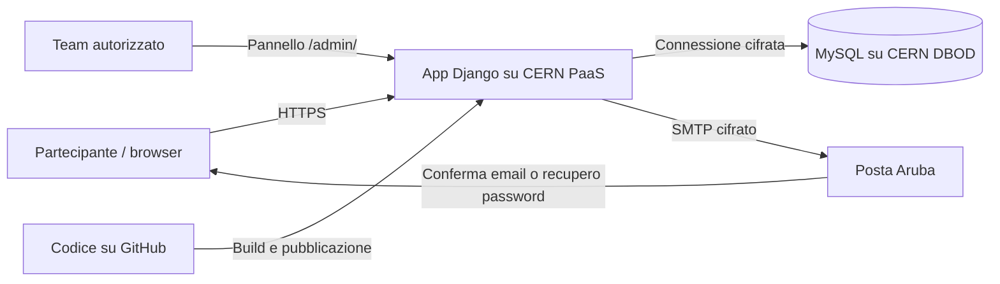

# ERNEST Community

La community di **ERNEST — European Researchers’ Night Escape Science Team** permette di esplorare quiz scientifici, creare un profilo e conservare i propri progressi. Si può iniziare a giocare anche senza registrarsi.

L’applicazione è scritta in **Python con Django**, con interfaccia **HTML, CSS e JavaScript**. È ospitata sulla piattaforma CERN PaaS e utilizza un database MySQL del servizio CERN Database on Demand. Le email di servizio vengono inviate tramite Aruba.

**Apri la community:** [ERNEST Community](https://ernest-test-ernest-community.app.cern.ch/)

L’indirizzo contiene ancora `ernest-test`: è l’indirizzo dell’attuale installazione di anteprima. Il codice utilizza già un database persistente e l’invio reale di email; non si tratta della sola dimostrazione grafica. I quiz presenti sono dimostrativi.

Questo documento è pubblico: descrive architettura, utilizzo e manutenzione generale. Credenziali, indirizzi privati dei database, dati degli iscritti e informazioni di recupero degli accessi non appartengono al repository.

## Cosa permette di fare

- Giocare senza account e vedere i risultati nella sessione corrente.
- Registrarsi con nickname, email e password.
- Confermare l’indirizzo email prima di accedere.
- Accedere da dispositivi diversi e ritrovare i progressi associati al profilo.
- Recuperare la password tramite email.
- Consultare iscritti e risultati attraverso un pannello amministrativo riservato.

L’email è utilizzata per l’account e le comunicazioni di servizio; il profilo usa il nickname. Non è implementato un forum, né un sistema di newsletter o una classifica pubblica degli iscritti.

## Come sono collegati gli strumenti



| Componente | A cosa serve | Perché lo utilizziamo |
| --- | --- | --- |
| **Team ERNEST / INFN** | Cura contenuti, sviluppo e gestione della community. | Definisce le funzionalità e mantiene il servizio applicativo. |
| **GitHub** | Conserva il codice e la cronologia delle modifiche. | Permette revisione, collaborazione e identificazione della versione pubblicata. Non conserva il database degli iscritti. |
| **Django** | Gestisce richieste, account, sessioni, quiz, email e amministrazione. | Fornisce una struttura applicativa con autenticazione, protezione dei moduli e accesso al database. |
| **CERN PaaS / OKD** | Esegue l’applicazione in un container e la rende raggiungibile via HTTPS. | Evita di dover gestire una macchina virtuale completa per eseguire il sito. |
| **CERN Database on Demand — DBOD** | Ospita il database MySQL persistente. | Separa i dati dai processi dell’app: un riavvio o una nuova pubblicazione non deve cancellare account e risultati. |
| **Aruba** | Gestisce il dominio del progetto e la posta utilizzata per l’invio delle email. | Recapita conferme di registrazione e recupero password. Non ospita il database dei quiz. |
| **Pannello Django `/admin/`** | Mostra iscritti e tentativi agli operatori autorizzati. | Consente la gestione quotidiana senza interrogare direttamente MySQL. |

Il sito informativo ERNEST su GitHub Pages e questa applicazione sono componenti distinti. GitHub Pages pubblica pagine statiche; la community richiede un’applicazione in esecuzione e un database. Anche `community-preview/`, presente nel repository, è una dimostrazione grafica distinta dall’app Django in questa cartella.

## Quale pannello aprire

### Community: per partecipanti

[Apri la community](https://ernest-test-ernest-community.app.cern.ch/).

I partecipanti usano un account **ERNEST**, creato con la propria email. **Non serve un account CERN**, né per giocare né per registrarsi.

### Amministrazione Django: per seguire gli iscritti

[Apri il pannello amministrativo](https://ernest-test-ernest-community.app.cern.ch/admin/).

L’accesso è riservato agli account della community ai quali siano stati assegnati i permessi necessari. Essere un utente registrato non dà accesso al pannello.

In questa revisione il pannello richiede il **nickname in minuscolo**, la password della community e un codice del proprio autenticatore TOTP. Il secondo fattore va attivato per ogni amministratore prima di pubblicare questa revisione; la procedura è in [SECURITY.md](SECURITY.md). Nel normale modulo di accesso della community si usano invece **email e password**.

**Utenti** mostra:

- nickname ed email;
- data di registrazione e ultimo accesso registrato da Django;
- stato della conferma email;
- numero di quiz distinti completati e punteggio totale;
- stato attivo o disattivato dell’account.

Si può cercare per nickname o email e filtrare per stato e data. L’elenco è ordinato dai nuovi iscritti ai meno recenti. “Ultimo accesso” indica un accesso registrato, non l’ultima pagina visitata o la presenza online in tempo reale.

Per disattivare un account, aprire la sua scheda, togliere la spunta **Attivo** e salvare. La disattivazione non cancella i dati. Un account in attesa di verifica deve completare il percorso di conferma email: la spunta Attivo non sostituisce tale conferma.

**Attempts** mostra i singoli tentativi: utente, quiz, punteggio, completamento e data di creazione. Un tentativo senza utente associato appartiene a una sessione ospite. La sezione è di sola lettura.

Il pannello non mostra password o relativi hash e non consente di modificare i punteggi. In questa versione non permette di creare o cancellare utenti, modificare i quiz o assegnare ruoli amministrativi. L’assegnazione dei permessi resta un’operazione dei manutentori autorizzati.

### CERN PaaS: per gestire l’applicazione

[Console CERN PaaS](https://paas.cern.ch/).

Serve un account CERN con accesso al progetto. È lo strumento tecnico per controllare pubblicazioni, processi, configurazione e problemi di esecuzione. Non è il pannello per consultare gli iscritti.

I nomi principali nell’interfaccia sono:

| Termine | Significato nell’applicazione |
| --- | --- |
| **Project / namespace** | Lo spazio che raggruppa le risorse della community. |
| **BuildConfig / Build** | Le istruzioni e l’esecuzione della preparazione di una nuova immagine a partire dal codice Git. |
| **Image** | Il pacchetto eseguibile che contiene codice e dipendenze. |
| **Deployment** | La configurazione che avvia e aggiorna l’applicazione. |
| **Pod** | Un’istanza in esecuzione del container. Può essere sostituita durante un aggiornamento. |
| **Service / Route** | Il collegamento al processo applicativo e l’indirizzo web esposto ai visitatori. |
| **Secret** | Il contenitore di configurazione riservata utilizzata dall’applicazione. I valori non vanno copiati nel codice o nei log. |
| **Job** | Un’attività che termina dopo l’esecuzione, per esempio un aggiornamento dello schema del database. |
| **Logs** | Messaggi utili a diagnosticare errori. Non vanno pubblicati senza verificare che non contengano dati personali o link riservati. |

### CERN DBOD: per gestire il servizio database

[Dashboard Database on Demand](https://dbod.web.cern.ch/) · [Portale risorse CERN](https://resources-portal.web.cern.ch/service/databases).

Il portale risorse riguarda la disponibilità del servizio per il proprio account; la dashboard DBOD riguarda le istanze database assegnate. Questi strumenti richiedono autorizzazioni CERN.

DBOD serve per controllare lo stato dell’istanza, le risorse e le funzioni di amministrazione, backup e ripristino disponibili. Per sapere chi si è registrato si usa invece il pannello Django.

La persistenza dei dati e il backup sono due cose diverse: MySQL conserva i dati oltre la vita di un pod; il backup serve a recuperarli dopo una perdita o un errore. Prima di affidarsi a un ripristino, il team deve verificare copertura, frequenza, conservazione e procedura previste per l’istanza. Questo README non certifica l’avvenuta verifica di tali impostazioni.

## Percorso tipico di un partecipante

### Esempio: dalla prima sfida al profilo personale

1. **Una visitatrice apre ERNEST Community.** Sceglie “A cavallo di un fotone” senza registrarsi.
2. **Risponde alle domande.** Il server controlla le risposte, attribuisce i punti e restituisce una spiegazione.
3. **Decide di conservare i progressi.** Apre “Accedi”, sceglie “Registrati” e inserisce nickname, email e password con conferma.
4. **Vede una conferma generica della richiesta.** Se i dati sono disponibili riceve la mail di verifica; un’email o un nickname già utilizzati non creano né modificano un account. Apre il link e preme “Conferma email”. Il link dura 24 ore; la sola apertura non attiva il profilo, così una scansione automatica della posta non basta a confermarlo.
5. **Accede con email e password.** I tentativi ospiti della sessione dalla quale effettua l’accesso vengono associati al suo account. Per recuperare quelli appena svolti deve tornare nello stesso browser e nella stessa sessione; la conferma email da sola non li trasferisce.
6. **Consulta “Il mio percorso”.** Vede quiz completati e punteggi. Una volta associati all’account, i progressi sono disponibili anche accedendo da un altro dispositivo.
7. **Ripete un quiz per migliorare.** Il totale usa il miglior tentativo completato per ogni quiz: ripeterlo non accumula punti illimitati.

Esempio: 20 punti e poi 30 nello stesso quiz contribuiscono al totale con **30 punti**. Un secondo quiz completato con 20 punti porta il totale a **50 punti**, con **2 quiz distinti completati**.

### Se dimentica la password

Da “Accedi” seleziona “Password dimenticata?”, indica l’email e segue il link ricevuto. Il link scade dopo un’ora e non è riutilizzabile dopo il cambio. La password precedente non viene mai inviata per email.

### Se non riceve la conferma

Controlla la posta indesiderata e usa “Reinvia conferma”. Il sistema limita gli invii ripetuti e restituisce messaggi generici per non rivelare se un indirizzo appartiene a un account.

## Percorso tipico di chi gestisce la community

1. Accede al pannello `/admin/` con un account autorizzato.
2. Apre **Utenti** per vedere le nuove registrazioni.
3. Distingue gli account confermati da quelli ancora in attesa.
4. Consulta completamenti e punteggi; apre **Attempts** quando serve il dettaglio dei tentativi.
5. In caso di problemi tecnici, passa alla console PaaS; consulta DBOD solo se il problema riguarda il database.

Non è necessario entrare nelle console CERN per ogni nuova registrazione. Non è previsto un avviso automatico agli amministratori per ciascun nuovo iscritto.

## Dove modificare testi, grafica e quiz

| File | Contenuto |
| --- | --- |
| [`templates/index.html`](templates/index.html) | Struttura della pagina principale e moduli della community. |
| [`static/community/`](static/community/) | Grafica, immagini e JavaScript dell’interfaccia. |
| [`community/quizzes.json`](community/quizzes.json) | Domande, opzioni, risposte corrette e spiegazioni dei quiz. |
| [`community/accounts.py`](community/accounts.py) | Testi delle email e flussi di conferma e recupero password. |
| [`templates/account.html`](templates/account.html) | Pagine aperte dai link di conferma e recupero. |
| [`community/admin.py`](community/admin.py) | Colonne, filtri e funzioni del pannello riservato. |
| [`community/models.py`](community/models.py) | Struttura dei dati applicativi. |
| [`config/settings.py`](config/settings.py) | Configurazione Django e lettura delle impostazioni d’ambiente. |

Cambiare un file su GitHub non modifica direttamente le tabelle MySQL. Per rendere visibile una modifica all’applicazione serve una nuova pubblicazione. I quiz sono definiti nel codice, non modificabili dal pannello amministrativo; essendo il repository pubblico, le risposte nel sorgente non sono segrete. La community è uno strumento divulgativo, non una piattaforma di esame con domande riservate.

## Come viene pubblicata una modifica

L’installazione attuale usa la cartella `community-app/` del ramo `codex/community-cern-preview`. Il ramo della community è distinto dal sito statico principale.

1. Modificare i file e verificare il risultato, preferibilmente attraverso una revisione del codice.
2. Salvare e pubblicare il commit sul ramo configurato per la community.
3. Avviare la build in PaaS e verificarne l’esito. Non presumere che il solo push pubblichi automaticamente la modifica: dipende dai trigger configurati.
4. Se cambia lo schema dei dati, applicare le migrazioni con una procedura coordinata e verificarne l’esito. Le migrazioni non vengono lanciate automaticamente da ogni processo web.
5. Verificare l’avvio della nuova versione e il funzionamento del sito pubblico.

La build usa l’immagine Python 3.12 UBI 9. [`app.sh`](app.sh) raccoglie i file statici e avvia Gunicorn; WhiteNoise distribuisce i file statici. Le impostazioni S2I sono in [`.s2i/environment`](.s2i/environment).

Le impostazioni specifiche dell’installazione, incluse connessioni database e posta, vengono fornite tramite configurazione d’ambiente e Secrets. In produzione Django richiede una chiave applicativa e la configurazione MySQL; SQLite è riservato allo sviluppo locale.

## Sviluppo locale

Da questa cartella, con Python compatibile con Django 5.2:

```sh
python3 -m venv .venv
.venv/bin/python -m pip install -r requirements.txt
DJANGO_DEBUG=1 .venv/bin/python manage.py migrate
DJANGO_DEBUG=1 .venv/bin/python manage.py runserver 127.0.0.1:8771
```

`mysqlclient` può richiedere librerie di sviluppo MySQL/MariaDB e strumenti di compilazione del sistema. Senza configurazione MySQL e con `DJANGO_DEBUG=1`, l’app usa SQLite locale.

Aprire `http://127.0.0.1:8771/`. Usare esclusivamente dati di prova: le email locali sono scritte in `preview-mails/` e le risposte di debug possono contenere link di test. Questa modalità non deve essere esposta come servizio pubblico. Database locale, ambiente virtuale ed email di prova sono esclusi dal versionamento.

Per eseguire i test:

```sh
DJANGO_DEBUG=1 .venv/bin/python manage.py test community
```

I test coprono, fra l’altro, associazione dei risultati alla sessione/account, punteggi, accessi non autorizzati, conferma e recupero password, protezione CSRF e restrizioni del pannello amministrativo. Non sostituiscono le verifiche sull’installazione CERN e sull’effettiva ricezione delle email.

## Manutenzione e gestione dei dati

CERN fornisce i servizi infrastrutturali; il team mantiene codice, dipendenze applicative, contenuti, configurazione e permessi. Utilizzare PaaS e DBOD non elimina queste attività. Gli aggiornamenti dell’app richiedono verifica e pubblicazione; le operazioni del servizio database seguono le procedure DBOD.

È disponibile il comando:

```sh
python manage.py cleanup_community
```

Rimuove tentativi ospiti più vecchi di 24 ore, sessioni scadute e contatori temporanei obsoleti. Va eseguito nell’ambiente autorizzato e pianificato se si vuole una pulizia automatica: la sola presenza del comando non implica che sia già schedulato. Non cancella gli account o i tentativi associati agli utenti registrati.

Devono essere definite e verificate le procedure per conservazione e cancellazione degli account, backup e ripristino, controllo degli accessi e gestione degli incidenti. La disattivazione nel pannello non equivale alla cancellazione richiesta da un interessato.

## Privacy e stato del servizio

Il servizio tratta dati personali: email, nickname, informazioni di autenticazione, sessioni e risultati associati agli account. Anche l’utilizzo senza account può comportare dati di sessione e log tecnici; “senza registrazione” non significa assenza di trattamento.

L’assetto organizzativo previsto è una community gestita nell’ambito INFN con fornitori tecnici CERN e Aruba. La disponibilità tecnica dell’installazione non certifica la formalizzazione dei ruoli privacy, delle autorizzazioni o degli accordi. L’informativa applicabile, i tempi di conservazione e le condizioni di partecipazione, compresa quella dei minori, devono essere definiti con i referenti competenti prima del lancio rivolto al pubblico. Questo README non sostituisce l’informativa agli utenti.

L’app include protezione CSRF, password gestite tramite hashing Django, cookie sicuri in produzione, connessione MySQL con verifica TLS e limiti ai tentativi. I limiti basati sull’indirizzo di rete richiedono attenzione dietro proxy: il contatore può essere condiviso fra visitatori. Health check, procedure di ripristino e gestione affidabile dell’indirizzo client restano verifiche operative dell’installazione, non garanzie implicite del codice.

## Riferimenti

- [CERN Web Services Portal](https://webservices-portal.web.cern.ch/) — accesso ai servizi di hosting.
- [CERN Platforms and Workflows](https://information-technology.web.cern.ch/about/organisation/platforms-and-workflows) — piattaforme per l’esecuzione delle applicazioni.
- [CERN Databases and Analytics](https://information-technology.web.cern.ch/about/organisation/databases-analytics) — servizi database e ripartizione delle attività infrastrutturali.
- [Guida CERN DBOD](https://cern.ch/dbod-user-guide) — procedure del servizio; alcune risorse possono richiedere accesso CERN.
- [DPO INFN](https://dpo.infn.it/) e [Data Privacy at CERN](https://privacy.web.cern.ch/) — riferimenti istituzionali sulla protezione dei dati.


## Lingue: italiano, francese e inglese

Il selettore **IT · FR · EN** nell’intestazione cambia la lingua della community: navigazione, profilo, quiz, risposte, spiegazioni e moduli di accesso. La prima visita usa una lingua supportata del browser, oppure l’italiano; la scelta manuale viene ricordata per un anno nel cookie `django_language` del browser. Non è una preferenza salvata nel profilo e può quindi essere diversa su un altro dispositivo.

Si può cambiare lingua anche durante un quiz: la domanda corrente, la risposta selezionata e il punteggio restano invariati. Ogni quiz conserva lo stesso identificatore nelle tre lingue, quindi i risultati non vengono duplicati.

Le email di conferma e recupero password vengono generate nella lingua attiva al momento della richiesta. Il link include la lingua per aprire la pagina corretta anche in un altro browser; anche queste pagine hanno il selettore.

### Aggiornare le traduzioni

- `community/translations.json` contiene le traduzioni inglesi e francesi, con il testo italiano come chiave. Copre sia l’interfaccia sia i contenuti dei quiz e le email.
- `community/i18n.py` applica il catalogo lato Django e conserva la lingua dei link email.
- `static/community/i18n.js` traduce l’interfaccia pubblica e gestisce il selettore insieme ad `app.js`.
- `templates/account.html` usa lo stesso catalogo per conferma email e recupero password. I messaggi standard dei moduli Django usano le traduzioni di Django.

Quando si modifica un testo italiano o si aggiunge un quiz, aggiornare anche entrambe le traduzioni mantenendo invariati i segnaposto, ad esempio `{name}` e `{score}`. I test verificano la copertura dei contenuti dei quiz e la lingua delle email. Il pannello amministrativo rimane uno strumento distinto: le etichette personalizzate del pannello sono in italiano.


## Classifica e distribuzione dei punteggi

La voce **Classifica** è accessibile solo agli utenti autenticati, nelle tre lingue. Anche l’API rifiuta le richieste senza login. Mostra un istogramma orizzontale con il numero di partecipanti per fascia di 10 punti. La tabella rende leggibili anche i valori numerici. Non vengono pubblicati elenchi di nickname, email o punteggi individuali.

Per ogni account attivo con email confermata e almeno un quiz completato si sommano i migliori risultati dei singoli quiz. I tentativi incompleti e quelli degli ospiti non entrano nella distribuzione. Ripetere lo stesso quiz non moltiplica i punti.

Chi accede vede inoltre il proprio punteggio, la posizione sul totale dei partecipanti e la propria fascia evidenziata. Gli utenti con lo stesso punteggio condividono la posizione (ad esempio 1, 1, 3). La risposta dell’API `/api/leaderboard/` contiene solo conteggi aggregati e, per l’utente autenticato, il suo risultato personale; non contiene identificatori degli altri iscritti e non viene memorizzata nelle cache condivise.


Il banner inferiore riprende il logo UE, la dichiarazione di finanziamento e lo stile del sito ERNEST. Mostra anche il copyright; contatore visite e collegamento alla cookie policy sono al momento omessi.

## Sicurezza, verifiche e pubblicazione

[SECURITY.md](SECURITY.md) descrive secondo fattore amministrativo, limiti di accesso, log, verifica del database, aggiornamenti con dipendenze bloccate, controlli automatici e rollback. Distingue i controlli presenti nel codice da quelli che richiedono attivazione o verifica nell’ambiente CERN.
